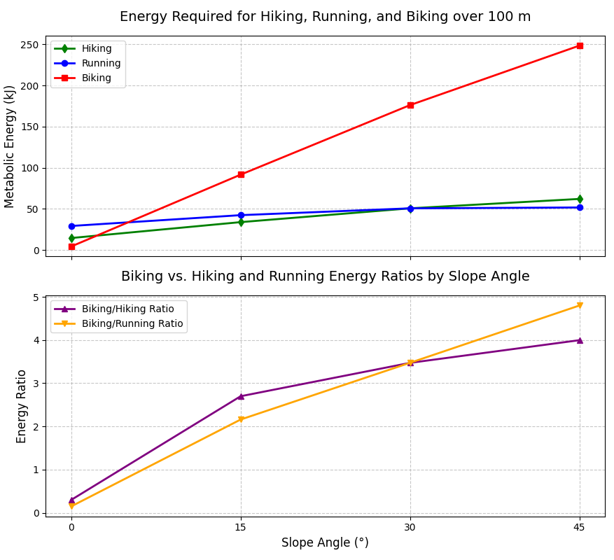

# Hiking vs. Running vs. Biking on Slopes

To plot the Curve in Python, use the following code, [View `hike_run_bike.py`](Python/hike_run_bike.py).  

## Assumptions

### Distance and Terrain
- **Distance**: 100 meters along the path (hypotenuse, includes horizontal and vertical components).
- **Surface**: Smooth pavement.
- **Slope Angles**: 0° (flat), 15°, 30°, 45°.

### Human and Bike Parameters
- **Hiker**: 70 kg (average adult).
- **Runner**: 70 kg (same person as hiker and cyclist).
- **Cyclist**: 70 kg (person) + 10 kg (bike) = **80 kg**.
- **Fitness Level**: Same person with similar fitness for both activities.

### Energy Efficiency
- **Hiking**: Metabolic efficiency ≈ 25%. (similar to running, reflecting human muscle efficiency in walking).
- **Running**: Metabolic efficiency ≈ 25% (only 25% of energy converts to mechanical work; most lost as heat).
- **Biking**: Mechanical efficiency ≈ 90% (bike efficiently transfers pedaling to motion), but human metabolic efficiency ≈ 25% for pedaling.
  
### Forces Considered
- **Biking**: 
  - Rolling resistance: $C_{rr} = 0.005$
  - Incline force due to gravity.
- **Hiking & Running**: 
  - Empirical energy costs, adjusted for slope angle.
- **Air resistance**: Ignored (low speeds: ~1.2 m/s for hiking, ~3 m/s for running and ~4 m/s for biking).

### Speed and Time
- **Hiking**: ~1.2 m/s → $time = 100 / 1.2 ≈ 83.33 s$
- **Running**: ~3 m/s → $time = 100 / 3 ≈ 33.33 s$
- **Biking**: ~4 m/s → $time = 100 / 4 = 25 s$

### Energy Type
- **Metabolic energy** (total energy expended by the body).
- Reported in **kJ** and **kcal**: $1 kcal = 4.184 kJ$

---

## Geometry

- Vertical height: $h = d * sin(θ)$
- Horizontal distance: $x = d * cos(θ)$
- Grade (for reference): Grade (%) = tan(θ) × 100
- With $d = 100 m$

---

## Key Differences Between Hiking, Running, and Biking

---

### 1. Speed and Intensity

**Hiking:**  
Typically slower, ~1.2 m/s (4.32 km/h, brisk walking pace), a moderate-intensity activity with lower impact and more sustained muscle engagement.

**Running:**  
Assumed at ~3 m/s (10.8 km/h, moderate jog), a high-intensity activity with significant biomechanical demands (e.g., ground impact, rapid muscle contractions).

**Biking:**  
Assumed at ~4 m/s (14.4 km/h, casual cycling), a moderate-intensity activity with smooth, continuous pedaling, relying on mechanical advantage (gears, wheels) to reduce effort on flat terrain.

**Impact:**  
- Hiking’s slower pace reduces baseline energy cost compared to running but may increase energy per unit distance on steep slopes due to prolonged effort.  
- Biking’s higher speed and mechanical efficiency make it less intensive than running on flat terrain, but steep slopes increase intensity due to gravitational resistance and added bike mass (80 kg vs. 70 kg for hiking/running).  
- Historically, biking enabled faster travel on flat routes, while hiking and running were better suited for varied terrains.

### 2. Biomechanical Efficiency

**Hiking:**  
Uses a more stable walking gait, with less vertical oscillation, potentially more efficient on flat terrain but less adaptable to steep slopes due to increased muscle strain.

**Running:**  
Involves a bouncing gait, with energy lost to vertical oscillation and ground reaction forces. Empirical energy costs (e.g., 1.0 kcal/kg/km on flat) reflect this inefficiency.

**Biking:**  
Relies on a seated pedaling motion, transferring energy efficiently through the bike’s mechanical system (wheels, gears), with ~90% mechanical efficiency.  
Energy losses occur mainly from rolling resistance ($C_{rr} = 0.005$) and human metabolic inefficiency (~25%).

**Impact:**  
- Hiking has a lower energy cost than running on flat terrain (0.5 kcal/kg/km vs. 1.0 kcal/kg/km) but similar or higher costs on steep slopes (e.g., 3.0 kcal/kg/km vs. 2.5 kcal/kg/km at 45°), where walking requires careful stepping and balance.  
- Biking is highly efficient on flat terrain (4.39 kJ vs. 14.64 kJ hiking, 29.29 kJ running), but efficiency drops on inclines due to the bike’s 10 kg mass and gravitational work, leading to higher energy costs (e.g., 248.4 kJ at 45°).  
- Historically, biking’s efficiency revolutionized flat-terrain travel, while hiking and running remained dominant in rugged landscapes.

### 3. Energy Cost on Inclines

**Hiking:**  
Energy costs increase with slope (e.g., 1.2 kcal/kg/km at 15°, 3.0 kcal/kg/km at 45°), but studies suggest a steeper rise for walking on inclines, as walking gait becomes less efficient at high angles (e.g., >20°), requiring more muscular effort for balance and propulsion.

**Running:**  
Empirical costs also increase with slope (e.g., 1.5 kcal/kg/km at 15°, 2.5 kcal/kg/km at 45°), reflecting stride adjustments and gravitational work.

**Biking:**  
Energy costs are calculated from mechanical work against rolling resistance ($F_{rolling} = 0.005 * 80 * 9.81$) and incline force ($F_{incline} = 80 * 9.81 * sin(θ)$), adjusted for bike efficiency (90%) and human efficiency (25%).  
Costs rise sharply with slope (e.g., 4.39 kJ at 0°, 248.4 kJ at 45°).

**Impact:**  
- Hiking’s energy cost may exceed running’s on very steep slopes (e.g., 62.15 kJ vs. 51.76 kJ at 45°), where running’s dynamic gait is more efficient for short distances.  
- Biking’s energy cost surpasses both hiking and running on inclines (e.g., 91.64 kJ at 15° vs. 33.95 kJ hiking, 42.43 kJ running), due to the added bike mass and gravitational work, making it 2.7–4.0x more costly than hiking and 2.2–4.8x more than running.  
- Historically, steep terrains favored hiking or running, while biking thrived on flat or gently sloped routes.

### 4. Practical Considerations

**Hiking:**  
More representative of historical foot travel (e.g., messengers, traders), with a sustainable pace for long distances, making it a better fit for your “History” playlist narrative.

**Running:**  
Assumes a consistent jogging pace, less common historically for long-distance travel due to high energy demands.

**Biking:**  
Requires a bicycle, a relatively modern invention (19th century), with high efficiency on flat terrain and paved surfaces but limited by terrain roughness and steepness.  
Practical for historical contexts like urban couriers or military bike units on flat roads.

**Impact:**  
- Hiking aligns with historical contexts like ancient trade routes or pilgrimages, offering lower energy costs on flat terrain but challenges on steep slopes.  
- Running was less common for sustained travel but suited for short, urgent tasks (e.g., messengers), with higher energy costs limiting its use.  
- Biking revolutionized travel on flat terrains in the modern era, but its high energy cost on steep slopes made it impractical for rugged historical routes, where hiking or running prevailed.

The energy trends (e.g., biking’s 3.3x less effort than hiking at 0°, 4.0x more at 45°) highlight why terrain dictated historical travel modes.

---

## Formulas

### Biking Mechanical Work

**Rolling Resistance**:

$$
F_{rolling} = C_{rr} * m * g
$$

**Incline Force**:

$$
F_{incline} = m * g * sin(θ)
$$

**Total Force**:

$$
F_{total} = F_{rolling} + F_{incline}
$$

**Work**:

$$
W = F_{total} * d
$$

**Mechanical Input Energy (90% efficient bike)**:

$$
E_{mechanical} = W / 0.9
$$

**Metabolic Energy (25% human efficiency)**:

$$
E_{metabolic} = E_{mechanical} / 0.25
$$

### Running Metabolic Energy (Empirical)

Energy cost in kcal/kg/km (converted to kJ) (Empirical Energy Cost:
For a 15° slope (~26.79% grade), the energy cost is 1.5 kcal/kg/km, based on biomechanical studies (e.g., Minetti et al., 2002) for steep inclines, reflecting increased gravitational work and biomechanical strain)

Below is a table summarizing the empirical energy costs for running over a 100-meter distance at the specified slope angles (0°, 15°, 30°, 45°), as used in the latest calculations. The formula is included, showing how metabolic energy was calculated for a 70 kg runner.

| Slope Angle (°) | Grade Equivalent (%) | Energy Cost (kcal/kg/km) | Formula (for 70 kg, distance km)    |  Metabolic Energy (kJ)   |
|-----------------|----------------------|--------------------------|-------------------------------------|--------------------------|
| 0°              | 0%                   | 1.0                      | 1.0 × 70 × horizontal_distance      | 7 × 4.184 = 29.29        |
| 15°             | ~26.79%              | 1.5                      | 1.5 × 70 × horizontal_distance      | 10.14 × 4.184 ≈ 42.43    |
| 30°             | ~57.74%              | 2.0                      | 2.0 × 70 × horizontal_distance      | 12.12 × 4.184 ≈ 50.71    |
| 45°             | ~100%                | 2.5                      | 2.5 × 70 × horizontal_distance      | 12.37 × 4.184 ≈ 51.76    |

#### Notes

- **Grade Equivalent**: Calculated as  
  Grade (%) = tan(θ) × 100

- **Distance**: For 100 m = 0.1 km, adjusted slightly for horizontal distance (e.g., at 15°,  
  $x = 100 × cos(15°) ≈ 96.59 m = 0.09659 km$)

- **Formula**:  
  $E_{metabolic} (kcal) = Energy Cost × Mass × Distance_{horizontal} (km)$  
  
  then converted to kJ:
  
  $E_{metabolic} (kJ) = E_{metabolic} (kcal) × 4.184$

- **Using horizontal distance instead of path distance, for example, the case of 15° slope**:  

  For a 15° slope, with a **path distance** of 0.1 km:
  $E_{metabolic} (kcal) = 1.5 × 70 × 0.1 = 10.5 kcal$

  However, in the table, we used the **horizontal distance** (cos(slope)) to align with biomechanical conventions for running energy costs:

  $E_{metabolic} (kcal) = 1.5 × 70 × cos(15°) = 1.5 × 70 × 0.09659258  ≈ 10.14222 kcal$

  Rounded to two decimal places (as shown in the table): 10.14 kcal

### Hiking Metabolic Energy (Empirical)

Below is the table for hiking, mirroring the structure of the running table:

| Slope Angle (°) | Grade Equivalent (%) | Energy Cost (kcal/kg/km) | Formula (for 70 kg, distance km)         | Metabolic Energy (kJ)       |
|------------------|-----------------------|----------------------------|------------------------------------------|-----------------------------|
| 0°               | 0%                    | 0.5                        | 0.5 × 70 × horizontal_distance           | 3.5 × 4.184 = 14.64         |
| 15°              | ~26.79%               | 1.2                        | 1.2 × 70 × horizontal_distance           | 8.11 × 4.184 ≈ 33.95        |
| 30°              | ~57.74%               | 2.0                        | 2.0 × 70 × horizontal_distance           | 12.12 × 4.184 ≈ 50.73       |
| 45°              | ~100%                 | 3.0                        | 3.0 × 70 × horizontal_distance           | 14.85 × 4.184 ≈ 62.15       |
  

### Key Differences in Formulas

#### Running:
- Relies on **empirical energy costs** ($kcal/kg/km$), adjusted for slope angle, and applied over horizontal distance:  
  $100 × cos(θ)$
- Simple multiplication:  
  $Energy Cost × 70 × Distance_{horizontal} (km)$, then converted to **kJ**
- Reflects **biomechanical complexity** (e.g., stride changes, muscle activation) via studied values

#### Biking:
- Calculated from **mechanical work** (rolling resistance + incline force) over **path distance** (100 m)
- Adjusts for:
  - **Bike efficiency** (~90%)
  - **Human metabolic efficiency** (~25%)
- More **physics-based**, with an **empirical adjustment** for flat terrain to account for baseline effort
---

## Step-by-Step Examples

### 1. Flat (0°)
- $h = 100 * sin(0°) = 0 m$
- $x = 100 * cos(0°) = 100 m = 0.1 km$

#### Running
- $E = 1 * 70 * 0.1 = 7 kcal = 29.29 kJ$

#### Biking
- $F_{rolling} = 0.005 * 80 * 9.81 = 3.924 N$
- $F_{incline} = 0$
- $W = 3.924 * 100 = 392.4 J = 0.3924 kJ$
- $E_{mech} = 0.3924 / 0.9 ≈ 0.436 kJ$
- $E_{metabolic} = 0.436 / 0.25 ≈ 1.744 kJ$

Empirical cycling estimate:
- $E = 0.15 * 70 * 0.1 = 1.05 kcal = 4.39 kJ$

---

### 2. Slope = 15°
- $h = 100 * sin(15°) ≈ 25.88 m$
- $x = 100 * cos(15°) ≈ 96.59 m = 0.0966 km$

#### Running
- $E = 1.5 * 70 * 0.0966 ≈ 10.14 kcal = 42.44 kJ$

#### Biking
- $F_{rolling} = 3.924 N$
- $F_{incline} = 80 * 9.81 * sin(15°) ≈ 202.3 N$
- $F_{total} ≈ 206.22 N$
- $W = 206.22 * 100 = 20622 J = 20.622 kJ$
- $E_{mech} = 20.622 / 0.9 ≈ 22.91 kJ$
- $E_{metabolic} = 22.91 / 0.25 ≈ 91.64 kJ$

---

### 3. Slope = 30°
- $h = 100 * sin(30°) = 50 m$
- $x = 100 * cos(30°) ≈ 86.6 m = 0.0866 km$

#### Running
- $E = 2.0 * 70 * 0.0866 ≈ 12.12 kcal = 50.73 kJ$

#### Biking
- $F_{rolling} = 3.924 N$
- $F_{incline} = 80 * 9.81 * sin(30°) = 392.4 N$
- $F_{total} ≈ 396.32 N$
- $W = 39632 J = 39.63 kJ$
- $E_{metabolic} ≈ (39.63 / 0.9) / 0.25 ≈ 176.13 kJ$

---

### 4. Slope = 45°
- $h = 100 * sin(45°) ≈ 70.71 m$
- $x = 100 * cos(45°) ≈ 70.71 m = 0.0707 km$

#### Running
- $E = 2.5 * 70 * 0.0707 ≈ 12.37 kcal = 51.77 kJ$

#### Biking
- $F_{incline} = 80 * 9.81 * sin(45°) ≈ 555.07 N$
- $F_{total} ≈ 558.99 N$
- $W = 55.9 kJ$
- $E_{metabolic} ≈ (55.9 / 0.9) / 0.25 ≈ 248.4 kJ$

---

## Energy Expenditure Comparison Table

This table compares the energy expenditure (in kilojoules) for Hiking, Running, and Biking at different slope angles, along with effort ratios of Biking relative to Hiking and Running.

| Slope | Hiking (kJ) | Running (kJ) | Biking (kJ) | Biking/Hiking Ratio | Biking/Running Ratio |
|-------|-------------|--------------|-------------|----------------------|-----------------------|
| 0°    | 14.64       | 29.29        | 4.39        | 3.3x less effort     | 6.7x less effort      |
| 15°   | 33.95       | 42.43        | 91.64       | 2.7x more effort     | 2.2x more effort      |
| 30°   | 50.73       | 50.71        | 176.13      | 3.5x more effort     | 3.5x more effort      |
| 30°   | 62.15       | 51.76        | 248.4       | 4.0x more effort     | 4.8x more effort      |

